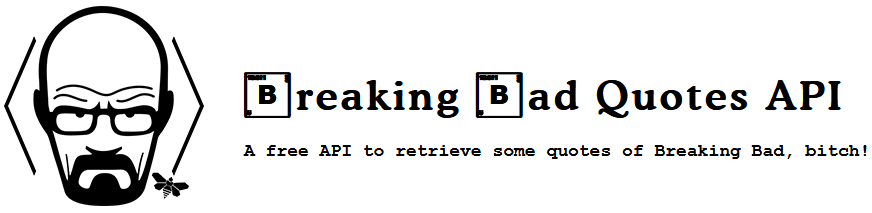

# Breaking Bad quotes API

A simple API to retrieve some quotes of Breaking Bad, bitch!

:globe_with_meridians: Website and demo: https://breakingbadquotes.xyz/

## Production host

🆕 [https://api.breakingbadquotes.xyz](https://api.breakingbadquotes.xyz)

OLD : [https://breaking-bad-quotes.herokuapp.com](https://breaking-bad-quotes.herokuapp.com)

## API

### `GET /v1/quotes`

Get a random quote in this format:

> [https://api.breakingbadquotes.xyz/v1/quotes](https://api.breakingbadquotes.xyz/v1/quotes)

	[
		{
			"quote": "I am not in danger, Skyler. I AM the danger!",
			"author": "Walter White"
		}
	]

### `GET /v1/quotes/{number}`

Returns an array with `{number}` quotes e.g. `GET /v1/quotes/5`.

> [https://api.breakingbadquotes.xyz/v1/quotes/5](https://api.breakingbadquotes.xyz/v1/quotes/5)

	[
	  {
	    "quote": "Clearly, his taste in women is the same as his taste in lawyers.",
	    "author": "Saul Goodman"
	  },
	  {
	    "quote": "Shut the f*ck up and let me die in peace.",
	    "author": "Mike Ehrmantraut"
	  },
	  {
	    "quote": "My name is ASAC Schrader, and you can go f*ck yourself.",
	    "author": "Hank Schrader"
	  },
	  {
	    "quote": "You all know exactly who I am. Say my name.",
	    "author": "Walter White"
	  },
	  {
	    "quote": "May his death satisfy you.",
	    "author": "Gustavo Fring"
	  }
	]

## Docker

You can find the Dockerfile [here](https://github.com/shevabam/dockerfiles/tree/master/breaking-bad-quotes) and on [Docker Hub](https://hub.docker.com/r/shevabam/breaking-bad-quotes/).

## Contributing

If you want to add some quotes, just add them in `quotes.js` file and do a pull request !

## Credits

Inspired by [Ron Swanson Quotes](https://github.com/jamesseanwright/ron-swanson-quotes).